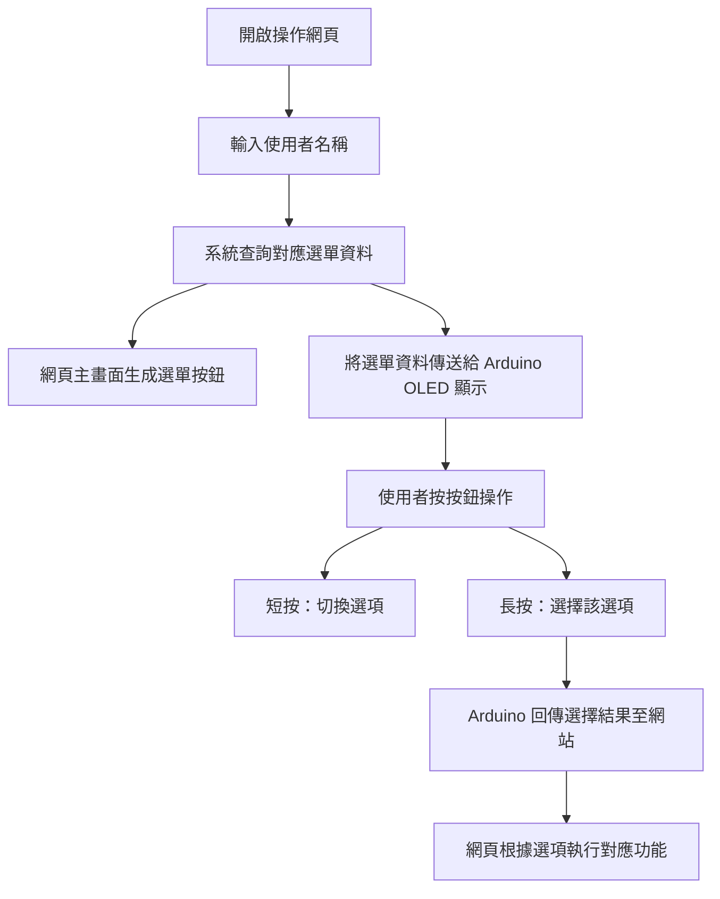

# 選單之下的我：AI 習慣學習型個人化操作系統

## 一、設計動機

現今的科技產品功能繁多、選單複雜，對於不熟悉科技的使用者而言（如長輩、小孩、科技冷感族群），操作常常成為一種負擔。本專題旨在設計一套「簡化且個人化的操作系統」，使用者只需輸入自己的身份名稱，系統即會主動提供其常用功能的操作選單，並透過簡單的實體按鈕與 OLED 顯示器進行操作，降低學習門檻，提升人機互動直覺性。

## 二、目標使用者與情境模擬

| 使用者         | 特徵        | 常見需求        | 系統提供的選單範例                    |
| ----------- | --------- | ----------- | ---------------------------- |
| Grandpa（長者） | 操作困難，記憶有限 | 打電話、看孫子、聽音樂 | 撥打孫子 / 播放收音機 / 看孫子照片         |
| Joy（小孩）     | 不識字、偏好圖像  | 看影片、玩遊戲     | YouTube Kids / 畫畫 App / 跳舞影片 |
| Leo（上班族）    | 多功能需求，重效率 | 查日程、開簡報     | 行事曆 / 查看簡報 / 傳訊息             |

## 三、系統互動流程（完整細節版）



## 四、系統組成與技術說明

### 前端（Web）
* HTML 輸入身份名稱
* JavaScript 載入對應選單
* Web Serial API 傳送選單資料給 Arduino
* 接收 Arduino 回傳選擇結果並執行網頁對應操作

### 選單資料格式
```json
{
  "grandpa": ["撥打孫子", "播放收音機", "看孫子照片"],
  "joy": ["YouTube Kids", "畫畫 App", "跳舞影片"],
  "leo": ["開行事曆", "查看簡報", "Slack 傳訊息"]
}
```

### Arduino
* 顯示選單文字（OLED，0.96 吋）
* 一顆按鈕控制（短按切換、長按選擇）
* 將選擇結果以 Serial 傳送回電腦端

## 五、使用材料清單

### 硬體元件
| 品項                   | 數量 | 用途      |
| -------------------- | -- | ------- |
| Arduino Uno / Nano   | 1  | 主控板     |
| OLED 顯示器（0.96 吋 I2C） | 1  | 顯示選單項目  |
| 按鈕（6x6x5mm）          | 1  | 切換與選擇功能 |
| 杜邦線 + 麵包板            | 若干 | 接線與測試使用 |
| 10kΩ 電阻              | 1  | 按鈕防浮點   |

### 軟體工具
* Arduino IDE
* Visual Studio Code / HTML 編輯器
* Google Chrome（支援 Web Serial API）

## 六、倫理與未來探討

### 使用者隱私與安全
* 本系統不儲存真實帳號與個資，僅使用匿名身份名稱（如 grandpa）
* 若未來需擴充為連接雲端平台，須考量以下風險：
  * 個人操作記錄若未加密，可能洩露行為模式
  * 必須提供刪除記錄的機制與資料使用告知

### 對 AI 的依賴與替代性思考
* 若無 AI，本系統僅能顯示固定選單，缺乏動態彈性與習慣調整能力
* AI 導入後的價值：
  * 可根據不同使用者呈現不同介面（個人化）
  * 可根據過去行為記錄調整選項順序（習慣學習）
  * 可預測下一步操作，降低選擇負擔

### 設計倫理建議
* 顯示「重設」、「顯示全部選單」選項，避免過度依賴推薦
* 加入「監護人模式」確保孩童使用安全
* 在未來擴充語音或推薦功能時，應考慮使用者授權與干預機制

## 七、未來發展想像
* 整合 Google Assistant 或 Alexa 等語音系統
* 延伸應用於智慧家庭面板、輔具、公共設備
* 串接 Google Drive、行事曆 API，實現真實文件操作
* 擴充 RFID 模組，自動判別身分並切換個人選單

## 八、展示建議
* 預備不同角色帳號供觀眾選擇（如 Grandpa / Joy）
* 展示 Arduino 顯示 OLED 選單同步畫面
* 使用者按鈕操作後，網頁同步跳轉或播放對應內容
* 搭配流程圖、角色卡與功能說明卡，提升說明效率